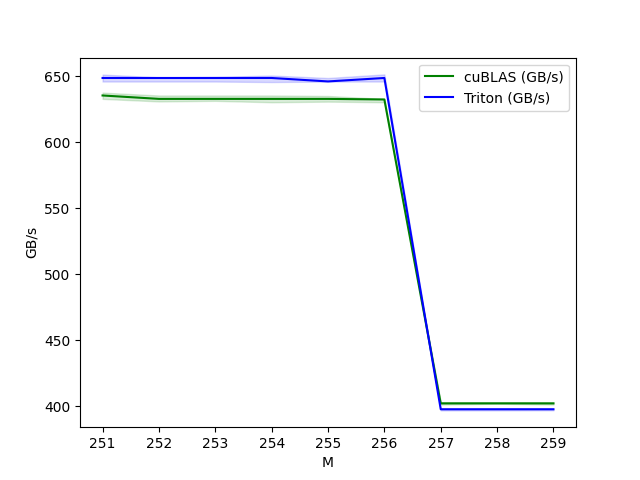
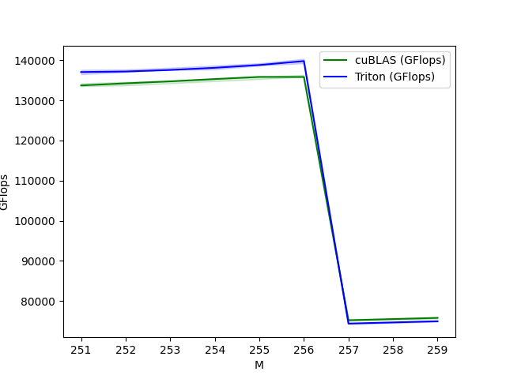
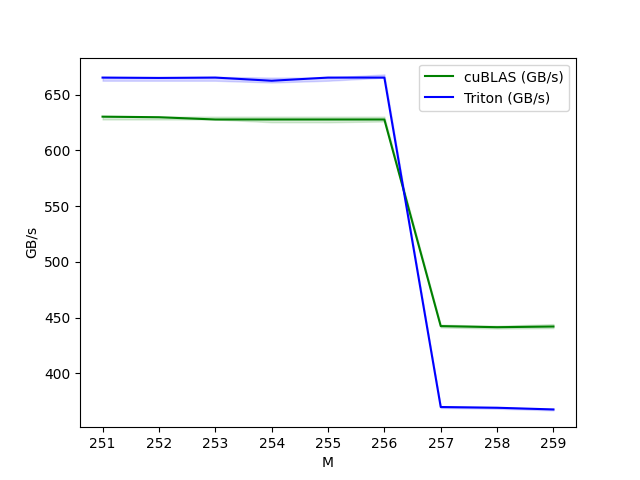

# Method 1
** for any number padding to next power of 2. **
#### File Name: main_optim_pow2_pad.py 
|  |  | 
|---|---|
# Method 2
** when M<=256 padding to 256, when M>256 add mask. ** 
####  File Name: main_optim_256_pad.py
|  |  | 
|---|---|
